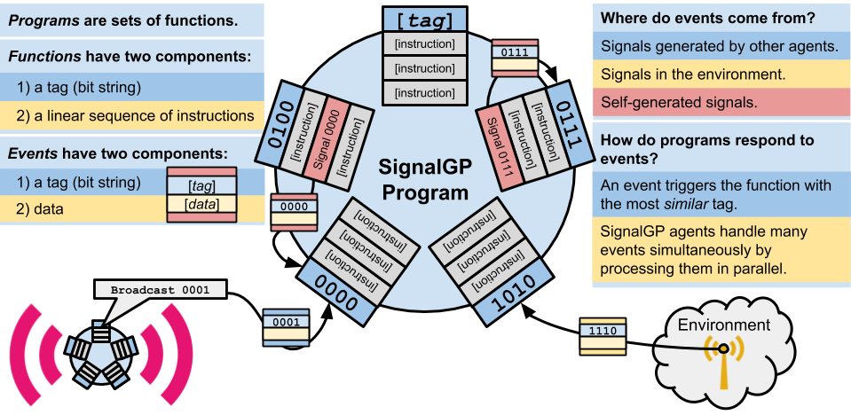
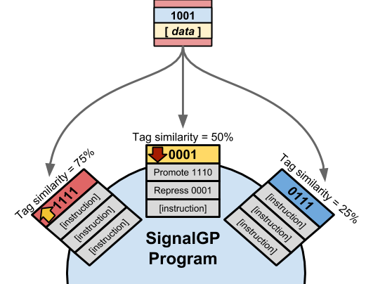
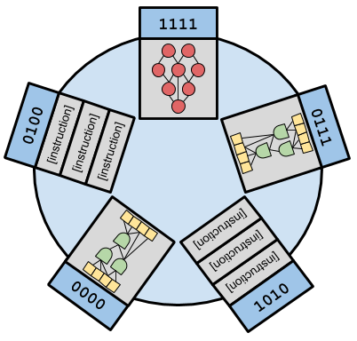
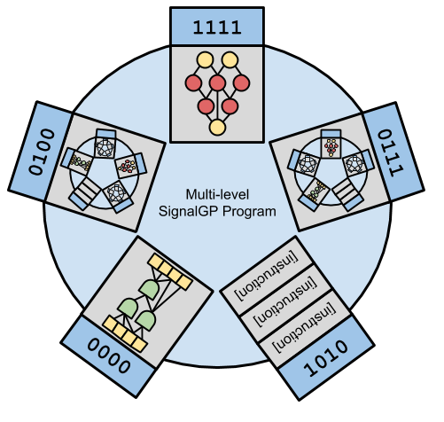

## Navigation

- [Repository Overview](#overview)
- [About SignalGP](#what-is-signalgp?)
  - [Experiment Instruction Set](#instruction-set)
- [Experiment Source Code](#experiment-source-code)
- [Data Analyses (statistical details, *etc.*)](#experimental-results-and-data-analyses)
- [Proposed Extensions to SignalGP](#signalGP-extensions)
- [GPTP Workshop Presentation](#workshop-presentation)
- [Document References](#references)

## Overview

This repository is associated with our 2018 Genetic Programming Theory and Practice (GPTP) workshop contribution, citation pending.

Spector et al. explored the use of tag-based naming for evolving modular programs in Chapter 1 of GPTP IX (Spector et al., 2011a). This contribution is a sort of follow up to Spector et al.'s 2011 chapter. We continue exploring tag-based referencing with SignalGP (Lalejini and Ofria, 2018). We investigate the importance of inexactness when making tag-based references: How important is imprecision when evolving programs that make use of evolvable names (i.e. tag-based referencing)? And, are there scenarios where requiring _some_ precision is necessary when making tag-based references?

In addition to experimentally investigating the importance of inexactness when employing tag-based referencing, we discuss three major extensions to SignalGP that are facilitated by tag-based referencing: SignalGP function regulation, multi-representation SignalGP, and major transitions in individuality with SignalGP.

### Contribution Authors

- [Alexander Lalejini](http://lalejini.com)
- [Charles Ofria](http://ofria.com)

### Abstract

> What else is in an evolved name? In this chapter, we continue to explore tag-based naming with SignalGP.
> Tags are evolvable labels that provide genetic programming (GP) a flexible mechanism for specification.
> Tags are used to label and refer to programmatic elements (e.g. code fragments).
> However, tags differ from traditional, more rigid methods for labeling programmatic elements because they allow for _inexact_ references (i.e. a referring tag need not _exactly_ match its referent).
> SignalGP is a GP technique designed to give evolution direct access to the event-driven paradigm where programs are organized as sets of modules, and signals (e.g. from the environment or from other agents) can trigger the execution of modules. SignalGP uses tag-based naming to determine which module is triggered in response to an event.
> We use SignalGP to explore the importance of inexactness in tag-based referencing. Additionally, we discuss broadened applications of tag-based naming in the context of SignalGP.

## What is SignalGP?

SignalGP is a genetic programming technique designed to give
evolution direct access to the event-driven programming paradigm. For full details on SignalGP, see [(Lalejini and Ofria, 2018)](https://arxiv.org/pdf/1804.05445.pdf).

In this work and in prior work, we use SignalGP in the context of linear GP (LGP) where programs are linear sequences of instructions. SignalGP programs (in the context of LGP) are sets of functions where each function associates a tag with a linear sequence of instructions.

### Instruction Set

The SignalGP instruction set we used for this work can be found here: [http://lalejini.com/GPTP-2018-Exploring-Evolvable-Specificity-with-SignalGP/documentation/instruction_set](http://lalejini.com/GPTP-2018-Exploring-Evolvable-Specificity-with-SignalGP/documentation/instruction_set).

## Experimental Source Code

The source code for all experiments performed in this contribution can be found in [./chg_env/source](./chg_env/source).

The compiling/running the experiments require the [Empirical library](https://github.com/devosoft/Empirical).

## Experiment Configuration Details

## Experimental Results and Data Analyses

Our experiments address the following questions:

- How important is imprecision when evolving programs that make use of evolvable names (i.e. tag-based referencing)?
  - Spoiler: Allowing for some imprecision is crucial. Exact name matching does not perform well.
- And, are there scenarios where requiring _some_ precision is necessary when making tag-based references?
  - Spoiler: Yes, when genetic programs need the capacity to _ignore_ references, requiring some minimum precision (tag-similarity) for tag-based references is important.

[A fully detailed data analysis for the experiments associated with this contribution can be found **here**](http://lalejini.com/GPTP-2018-Exploring-Evolvable-Specificity-with-SignalGP/analysis/stats.html).

## SignalGP Extensions

In addition to experimentally poking tag-based referencing, our paper discusses several extensions to SignalGP, each briefly discussed below.

### Function regulation

SignalGP is easily extended to model gene regulatory networks where functions can be up-regulated (i.e. be made more likely to be referenced by a tag) or down-regulated (i.e. be made less likely to be referenced by a tag). We can associate a regulatory modifier with each function that adjusts the calculated similarity between the function’s tag and any referring tag (e.g. a call instruction or event tag). We can add regulatory instructions to the instruction set that increase or decrease function regulatory modifiers, using tag-based referencing to determine which function should be regulated by a particular instruction.

Function regulation provides yet another mechanism for phenotypic flexibility, allowing SignalGP programs to alter referential relationships in response to environmental feedback. Such a mechanism might be useful for problems that require within-lifetime learning or general behavioral plasticity.

### Multi-representation SignalGP

SignalGP functions are, at their core, input-output machines. Thus far, we have arbitrarily chosen to stick linear GP inside of SignalGP functions; however, we could have used any representation capable of processing input and producing output (by generating signals or by manipulating memory). We could even employ multiple representations (e.g. ANNs, Markov network brains, handcoded modules, etc) within the same SignalGP program.

### Major transitions in individuality with SignalGP

In a major evolutionary transition in individuality, formerly distinct individuals unite to form a new, more complex lifeform, redefining what it means to be an individual. The evolution of eukaryotes, multi-cellular life, and eusocial insect colonies are all examples of transitions in individuality.

We can take the multi-representation extension to SignalGP one step further. We can consider a single SignalGP program as an input-output machine in and of itself. Thus, we can imagine a 'major transitions in individuality' mutation operator that, when applied, adds a function to the mutated individual that contains a copy of another SignalGP agent in the population. This type of mutation operator would generate hierarchically organized SignalGP programs where programs may be composed of (homogeneous or heterogeneous) groups of SignalGP programs where each of these sub-programs may themselves be composed of many SignalGP programs, _et cetera_.

## Workshop Presentation

My presentation from the 2018 GPTP workshop can be found [here](https://docs.google.com/presentation/d/1KF9iQb08CtQiWYD4py53DDJD_kjzT2U6Z3CtqfF8Bdc/edit?usp=sharing). Feel free to leave comments.

## References

Lalejini, A., & Ofria, C. (2018). Evolving Event-driven Programs with SignalGP. In Proceedings of the Genetic and Evolutionary Computation Conference. ACM. https://doi.org/10.1145/3205455.3205523

Spector, L., Harringtion, K., Martin, B., & Helmuth, T. (2011a). What’s in an Evolved Name? The Evolution of Modularity via Tag-Based Reference. In R. Riolo, E. Vladislavleva, & J. H. Moore (Eds.), Genetic Programming Theory and Practice IX (pp. 1–16). New York, NY: Springer New York. https://doi.org/10.1007/978-1-4614-1770-5

Spector, L., Martin, B., Harrington, K., & Helmuth, T. (2011b). Tag-based modules in genetic programming. GECCO ’11: Proceedings of the 13th Annual Conference on Genetic and Evolutionary Computation, 1419–1426. https://doi.org/doi:10.1145/2001576.2001767
